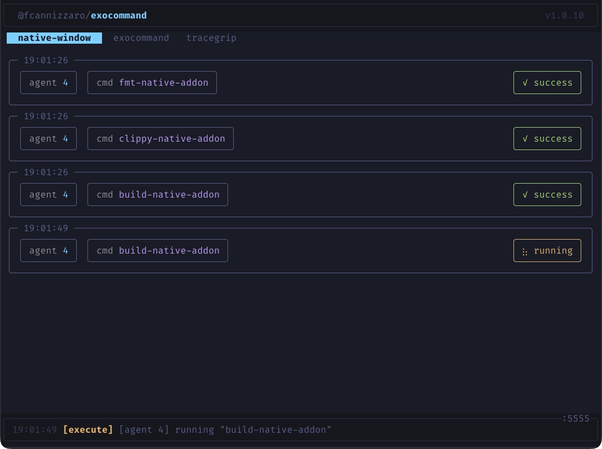

If you run AI coding agents inside Docker containers or sandboxes, you already know the trade-off: the agent can do its thing safely, but some commands need to run on the actual machine -- PlatformIO compile-flash-monitor cycles, Rust builds, database migrations, deployment pipelines. Giving the agent unrestricted shell access on the host is not an option.

I wanted a thin layer between the agent and my shell -- something that lets me define exactly which commands are allowed and blocks everything else. And since I work across multiple repositories, I needed a single process to manage all of them. So I built [exocommand](https://github.com/fcannizzaro/exocommand).

## The idea

Exocommand is a centralized TypeScript MCP server. You register projects with the CLI, each getting a unique access key and its own `.exocommand` YAML config listing the allowed commands.

```bash
# Create a config file in your project directory
bunx @fcannizzaro/exocommand init

# Register the project and get an access key
bunx @fcannizzaro/exocommand add .
```

A config file looks like this:

```yaml
build:
  description: "Run the production build"
  command: "cargo build --release"

clippy:
  description: "Run clippy linter"
  command: "cargo clippy"

list-external:
  description: "List files in parent directory"
  command: "ls -a"
  cwd: ../
```

The server exposes two tools: `listCommands()` returns every command from the config, and `execute(name, timeout?)` runs one by name, streaming output back to the client.

## How it works under the hood

The server loads all registered projects from `~/.exocommand/exocommand.db.json` and watches each `.exocommand` file for changes -- edit a config while running and connected clients are notified automatically.



Key features:

- **TUI dashboard** -- real-time terminal UI with project tabs, execution cards, and status indicators
- **SSE streaming** -- stdout/stderr streamed line-by-line back to the client in real time
- **Task mode** -- opt-in via `EXO_TASK_MODE`, creates background tasks using the MCP experimental tasks API for crash-resilient workflows
- **Concurrent sessions** -- Streamable HTTP transport allows multiple MCP sessions across projects simultaneously

The port defaults to `5555` (override via `EXO_PORT`).

## Setting it up

```bash
bunx @fcannizzaro/exocommand init    # create config
bunx @fcannizzaro/exocommand add .   # register project
bunx @fcannizzaro/exocommand         # start server
```

The server starts at `http://127.0.0.1:5555/mcp`. Point your MCP client at that endpoint with the `exocommand-project` header set to your access key:

```json
{
  "mcp": {
    "exocommand": {
      "enabled": true,
      "type": "remote",
      "url": "http://host.docker.internal:5555/mcp",
      "headers": {
        "exocommand-project": "<access-key>"
      }
    }
  }
}
```

The URL uses `host.docker.internal` so agents running inside a Docker container or sandbox can reach the exocommand server on the host machine.

Source and docs are on [GitHub](https://github.com/fcannizzaro/exocommand).
