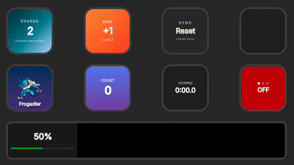
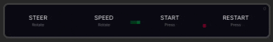

The official `@elgato/streamdeck` SDK is powerful but low-level. You track state manually, wire hardware events by hand, and generate key images yourself. Even a simple counter becomes a mix of event handlers, state bookkeeping, and rendering code. I wanted the same model I use in React apps -- declare what the key looks like, let the framework handle the rest. So I built `@fcannizzaro/streamdeck-react`.

## How it works

You write a React component for each action surface. `defineAction()` maps it to a manifest UUID. `createPlugin()` registers your actions and fonts, then `plugin.connect()` attaches to the Stream Deck runtime.

Each visible action instance on the hardware gets its own isolated React root -- separate state, separate lifecycle. When state changes trigger a re-render, the library renders the JSX tree to an image via the native [Takumi](https://github.com/aspect-build/takumi) renderer and pushes it to the device. A 4-phase skip hierarchy prevents redundant work at every step.

<div style="background:#262626;padding:16px;padding-bottom:1px;border-radius:8px;margin:1.5rem 0">

<span style="opacity: 0.7">1st row: zustand state, 2rd row: tanstack query, react basic hooks</span>



</div>

<div style="background:#262626;padding:16px;padding-bottom:1px;border-radius:8px;margin:1.5rem 0">

<span style="opacity: 0.7">snake game in the Stream Deck+ LCD display</span>



</div>

## Counter example

```tsx
import { createPlugin, defineAction, useKeyDown, cn, googleFont } from '@fcannizzaro/streamdeck-react';
import { useState } from 'react';

function CounterKey() {
  const [count, setCount] = useState(0);

  useKeyDown(() => setCount((c) => c + 1));

  return (
    <div
      className={cn(
        'flex h-full w-full flex-col items-center justify-center gap-1',
        'bg-linear-to-br from-[#0f172a] to-[#1d4ed8]',
      )}
    >
      <span className="text-[12px] font-semibold uppercase tracking-[0.2em] text-white/70">
        Count
      </span>
      <span className="text-[34px] font-black text-white">{count}</span>
    </div>
  );
}

const counterAction = defineAction({
  uuid: 'com.example.react-counter.counter',
  key: CounterKey,
  info: {
    name: 'Counter',
    icon: 'imgs/actions/counter',
  },
});

const plugin = createPlugin({
  fonts: [await googleFont('Inter')],
  actions: [counterAction],
});

await plugin.connect();
```

`defineAction()` accepts an `info` field that drives automatic `manifest.json` generation at build time -- no hand-written manifest needed. The `googleFont()` helper downloads and caches the font from Google Fonts.

## Rendering pipeline

The rendering pipeline is built around minimizing redundant work. Every render attempt passes through four phases before anything reaches the hardware:

1. **Dirty-flag check** -- O(1) boolean check on the container root. If no VNode was mutated since the last flush, the entire render is skipped.
2. **Merkle-tree hash + image cache** -- a structural hash of the VNode tree is compared against a byte-bounded LRU cache. Unchanged subtrees reuse cached hashes, so a single-node mutation only rehashes O(depth) nodes.
3. **Takumi render** -- the VNode tree is converted directly to Takumi nodes (bypassing `React.createElement`) and rasterized by the native Rust renderer. This can run on a worker thread to keep the main thread free for event handling.
4. **xxHash output dedup** -- the raw pixel buffer is hashed via xxHash-wasm. If it matches the previous frame, encoding and the hardware push are skipped entirely.

On top of this, an adaptive debounce detects whether a root is animating (0ms delay), interactive (16ms), or idle (configurable), and a flush coordinator with four priority levels ensures animated and interactive keys get first access to the USB bus.

## What you get

### Hooks

- **Event hooks** -- `useKeyDown`, `useKeyUp`, `useDialRotate`, `useDialPress`, `useTouchTap` and more for direct hardware input
- **Gesture hooks** -- `useTap`, `useLongPress`, `useDoubleTap` for higher-level input handling on keys and touch surfaces
- **Animation hooks** -- `useSpring` (physics-based damped harmonic oscillator) and `useTween` (duration/easing) for smooth value transitions, with built-in presets like `wobbly`, `stiff`, `gentle`, and `snap`
- **Settings hooks** -- `useSettings` and `useGlobalSettings` for per-action and plugin-wide persistent state, synced with the Property Inspector
- **Coordinator hooks** -- `useChannel` for cross-action shared state and `useActionPresence` for tracking which actions are currently visible
- **TouchStrip hooks** -- `useTouchStrip` for rendering across the full-width Stream Deck+ touch display
- **Lifecycle hooks** -- `useWillAppear`, `useWillDisappear` for mount/unmount logic
- **SDK hooks** -- `useStreamDeck`, `useAction`, `useDevice` for accessing the underlying SDK

### Components

- **Layout primitives** -- `Box`, `Text`, `Image`, `Icon` for building compact UIs on tiny displays
- **Data visualization** -- `ProgressBar` and `CircularGauge` for status indicators
- **Error handling** -- `ErrorBoundary` wraps every action root automatically, one crash doesn't take down the plugin

### Styling

- **Tailwind CSS** -- `cn()` helper for Tailwind-like utility strings, with full Tailwind v4 support via compiled stylesheets
- **CSS Theme System** -- `defineTheme()` for centralized design tokens as CSS custom properties, with runtime switching via `useTheme()` and composable theme merging via `mergeThemes()`

### Architecture

- **One root per instance** -- each visible action gets its own isolated React root with separate state, settings, and lifecycle
- **Root recycling** -- dormant roots are pooled and reused on profile switches, reducing latency from ~15ms to ~3ms per key
- **Manifest auto-generation** -- `defineAction({ info })` metadata is extracted via AST analysis at build time to generate `manifest.json`
- **Shared state** -- Zustand, Jotai, and React Query plug in through the wrapper API on `createPlugin` or `defineAction`
- **DevTools** -- browser-based inspector for debugging layouts, state, and render performance
- **React Compiler** -- optional integration via Babel plugin to automatically optimize re-renders
- **Agent Skill** -- installable AI skill that teaches coding agents the full API surface for assisted plugin development

## Real-world use case: HoYo Deck

[HoYo Deck](https://hoyodeck.fcannizzaro.com) is a free Stream Deck plugin I built with `streamdeck-react` for HoYoverse games (Genshin Impact, Honkai: Star Rail, Zenless Zone Zero). It tracks stamina, banners, endgame progress, daily rewards, and more -- with full support for Stream Deck+ dials and touch displays.

It exercises most of the library's features in production:

- **Animated gauges** -- resin, trailblaze power, and battery charge use circular gauges with spring animations
- **Shared state via coordinator** -- the stamina overview dial action shows up to three games side-by-side, sharing data across actions with `useChannel`
- **Settings sync** -- HoYoLAB account credentials and per-game toggles are managed through `useSettings` with a custom Property Inspector
- **TouchStrip rendering** -- the stamina overview renders a full-width layout across the Stream Deck+ touch display
- **Encoder support** -- the wish tracker uses dial rotation to increment a pity counter, press for +10, tap to reset

If you're curious, the source is on [GitHub](https://github.com/fcannizzaro/hoyodeck) and the plugin is free on the [Elgato Marketplace](https://marketplace.elgato.com).

## Get started

```bash
bun create streamdeck-react
```

The CLI scaffolds a complete `.sdPlugin` project -- manifest, bundler config (Vite with Rolldown), fonts, and a starter example. Pick from minimal, counter, Zustand, Jotai, or Pokemon (React Query) templates.

For manual setup:

```bash
bun add @fcannizzaro/streamdeck-react react
```

Full documentation at [streamdeckreact.fcannizzaro.com](https://streamdeckreact.fcannizzaro.com). Source on [GitHub](https://github.com/fcannizzaro/streamdeck-react). Package on [npm](https://www.npmjs.com/package/@fcannizzaro/streamdeck-react).
