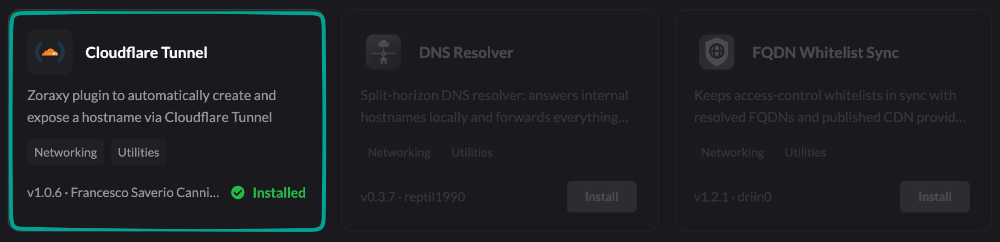

I use Zoraxy to manage the services in my homelab. Some should stay available only on my local network, while others need to work when I am away from home.

I built [Zoraxy Cloudflare Tunnel](https://github.com/fcannizzaro/zoraxy-cloudflare-tunnel) to manage both cases from the same proxy setup. Local services continue to use Zoraxy directly; selected hostnames are also routed through a Cloudflare Tunnel.

## What the plugin does

From its Zoraxy dashboard, the plugin can:

- create or reuse a Cloudflare Tunnel
- configure its ingress rules
- create the required proxied DNS records
- start and stop `cloudflared`
- restart the tunnel automatically with Zoraxy

Traffic reaches Cloudflare first, travels through the outbound tunnel connection, and then returns to Zoraxy. Zoraxy still decides which internal service receives the request.

## Setup

Install Cloudflare Tunnel from the Zoraxy plugin marketplace.



The host running Zoraxy also needs `cloudflared`:

```bash
cloudflared --version
```

In Cloudflare, create an API token with these permissions:

- **Account / Cloudflare Tunnel / Edit**
- **Zone / DNS / Edit**

Then open the plugin, enter the account and zone IDs, add the public hostnames, and apply the configuration. Each hostname must already have a matching proxy rule in Zoraxy.

This keeps internal routing and external access in one place, without exposing the homelab network directly or maintaining tunnel configuration by hand.

Source and installation details are on [GitHub](https://github.com/fcannizzaro/zoraxy-cloudflare-tunnel).
