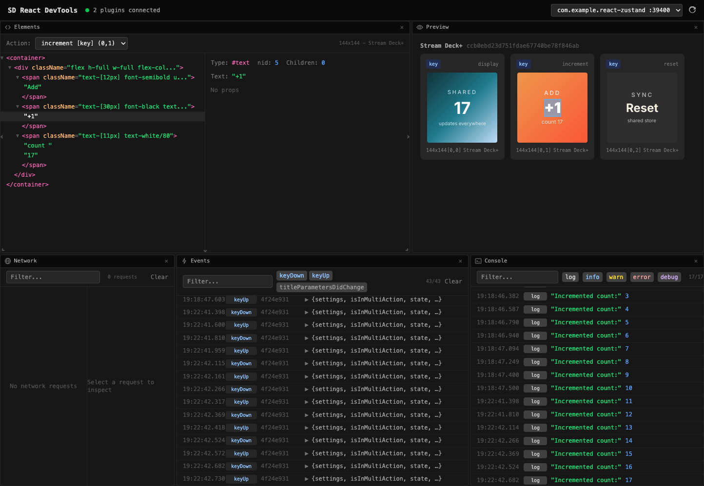

A library that lets you build Elgato Stream Deck plugins with React -- JSX, hooks, and state instead of imperative SDK callbacks and manual image generation. Each visible action on the hardware gets its own isolated React root; when state changes trigger a re-render, the library renders the JSX tree to an image and pushes it to the device.

## Motivation

The official `@elgato/streamdeck` SDK is powerful but low-level. You track state manually, wire hardware events by hand, and generate key images yourself. Even a simple counter becomes a mix of event handlers, state bookkeeping, and rendering code. I wanted the same model I use in React apps -- declare what the key looks like, let the framework handle the rest.

## Features

- **Declarative rendering** -- describe keys as JSX, not imperative draw calls
- **Full React hooks** -- `useState`, `useEffect`, `useRef`, `useContext`, custom hooks all work as expected
- **Hardware-aware hooks** -- `useKeyDown`, `useDialRotate`, `useTouchTap`, settings hooks, lifecycle hooks, and SDK helpers compose with the rest of React
- **Gesture hooks** -- `useTap`, `useLongPress`, `useDoubleTap` for higher-level input handling on keys and touch surfaces
- **Built-in primitives** -- `Box`, `Text`, `Image`, `Icon`, `ProgressBar`, `CircularGauge`, and `ErrorBoundary` for compact device UIs
- **Flexible styling** -- inline styles, `className`, and a `tw()` helper for Tailwind-like utility strings
- **Encoder and dial support** -- separate `key` and `dial` components per action, with `useDialHint` for Stream Deck+ trigger descriptions
- **TouchBar component** -- render custom content on the Stream Deck+ touch display strip
- **Shared state** -- Zustand, Jotai, and React Query plug in through the wrapper API on `createPlugin` or `defineAction`
- **Output caching** -- FNV-1a hashing skips `setImage()` when the frame hasn't changed
- **Error boundaries** -- every action root is wrapped automatically, one crash doesn't take down the plugin
- **DevTools** -- browser-based inspector for debugging layouts and state during development
- **React Compiler** -- optional integration via Babel plugin to automatically optimize re-renders


<p style="text-align:center;opacity:0.5;font-size:0.85em;margin-top:0.5rem">browser-based devtools inspector</p>

## Getting started

```bash
bun create streamdeck-react
```

The CLI scaffolds a complete `.sdPlugin` project -- manifest, bundler config, fonts, and a starter example. Pick from minimal, counter, Zustand, Jotai, or React Query templates.

For manual setup:

```bash
bun add @fcannizzaro/streamdeck-react react
```

## Links

- [Documentation](https://streamdeckreact.fcannizzaro.com)
- [GitHub](https://github.com/fcannizzaro/streamdeck-react)
- [npm](https://www.npmjs.com/package/@fcannizzaro/streamdeck-react)
